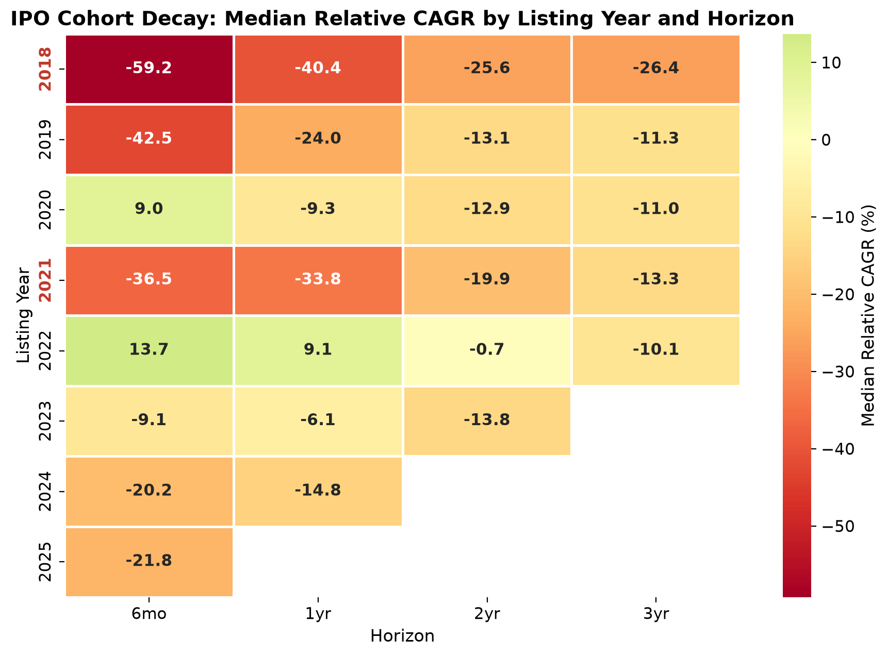
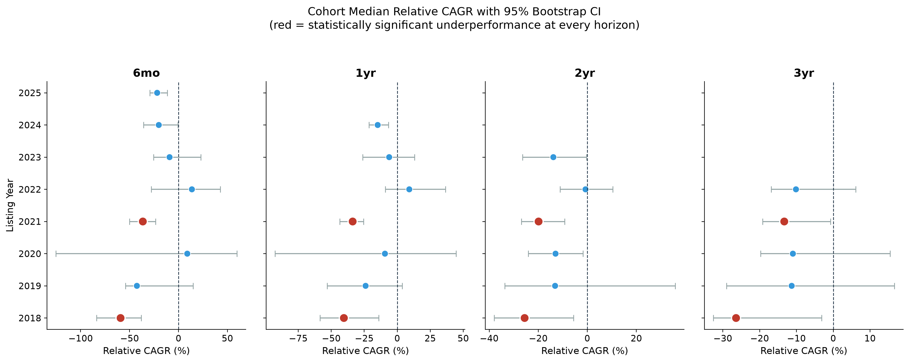
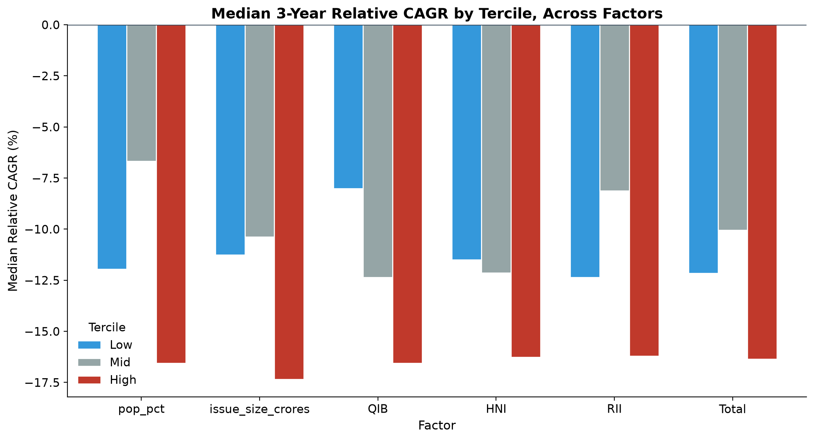
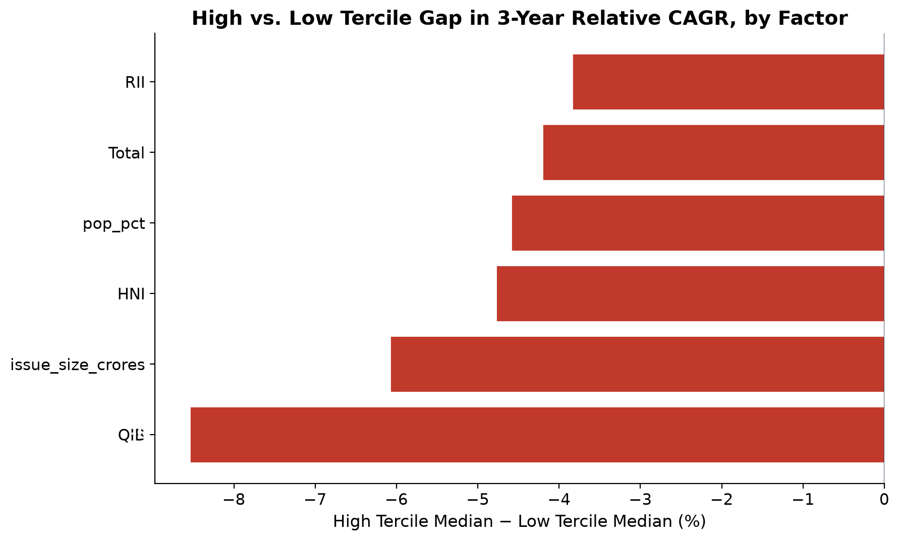

# NSE IPO Cohort & Performance Analysis

**Do IPOs from "hot" market years underperform in the long run — and does a stock's opening-day pop actually predict anything?**

An end-to-end quantitative analysis of 397 NSE mainboard IPOs (2018–2025), built from raw data collection through statistical hypothesis testing, to answer two questions:

1. **Cohort decay** — Do IPOs listed in high-volume, "frothy" years (2021 in particular) underperform IPOs from quieter years, once matched against the market?
2. **Signal vs. noise** — Does a stock's listing-day pop % (or issue size, or investor subscription levels) predict its long-term performance, or is it a red herring?

`Python` · `pandas` · `SQLite` · `scipy` · `yfinance` · `matplotlib`/`seaborn`

---

## TL;DR

- **2018 and 2021 are the only listing-year cohorts that significantly underperform the Nifty 50 at every horizon from 6 months to 3 years** (Wilcoxon signed-rank, p < 0.05 throughout). 2021's gap is worst in year one and two — and it closes by year three not because 2021 recovers, but because the rest of the market catches down to it.
- **Listing-day hype doesn't predict returns — in the linear sense.** Pop %, issue size, and subscription levels all show statistically negligible correlation with long-term performance (Spearman r between -0.12 and +0.14).
- **But it does predict returns non-linearly.** Split IPOs into thirds by any of these signals, and the most-hyped third is consistently the worst 3-year performer — a pattern a single correlation coefficient completely misses.

*Every return is measured relative to the Nifty 50, not in isolation — so these are findings about genuine market-relative performance, not just raw price movement.*

---

## At a Glance

| | |
|---|---|
| **IPOs analyzed** | 397 (NSE mainboard, 2018–2025) |
| **Daily price rows processed** | 305,199 |
| **Benchmark** | Nifty 50 (`^NSEI`) |
| **Horizons tested** | 6mo, 1yr, 2yr, 3yr |
| **Statistical tests** | Mann-Whitney U, Wilcoxon signed-rank, Spearman correlation, bootstrapped CIs |
| **Data cutoff** | 2026-06-30 (fixed, for reproducibility) |

---

## Table of Contents

- [Methodology](#methodology-locked-decisions-applied-throughout)
- [Project Structure](#project-structure)
- [Step 1 — Data Collection & Ticker Matching](#step-1-data-collection--ticker-matching)
- [Step 2 — Price History Enrichment](#step-2-price-history-enrichment)
- [Step 3 — SQL Return Calculations](#step-3-sql-return-calculations)
- [Step 4 — Cohort Decay Analysis](#step-4-cohort-decay-analysis-part-a)
- [Step 5 — Listing-Day Signals vs. Performance](#step-5-listing-day-signals-vs-long-term-performance-part-b)
- [Step 6 — Visualization & Presentation](#step-6-visualization--presentation)
- [Skills Demonstrated](#skills-demonstrated)
- [Tools & Libraries](#tools--libraries)
- [Data Sources](#data-sources)

---

## Methodology (locked decisions, applied throughout)

- **Forward returns measured from listing-day close**, not issue price — keeps listing-day pop % statistically independent from long-term return calculations
- **CAGR used for cross-horizon comparisons**, alongside raw % returns — since companies have varying amounts of elapsed trading history, CAGR allows fair comparison regardless of holding period
- **Fixed data cutoff: 2026-06-30** (not a dynamic "today") — ensures the analysis is fully reproducible on re-runs, regardless of when the pipeline is executed
- **Nifty 50 (`^NSEI`) as benchmark** — every return is calculated both in raw terms and relative to the index, isolating genuine outperformance from broad market movement
- **Horizon-maturity filtering** — a listing year is only included in a given horizon's comparisons if every IPO from that year has had enough time to reach it (e.g., 3-year comparisons exclude 2023–2025 cohorts). Prevents comparing fully-matured cohorts against partially-matured, listing-date-biased subsets
- **Non-parametric statistics throughout** (Mann-Whitney U, Wilcoxon signed-rank, Spearman correlation, bootstrapped confidence intervals) — IPO returns and subscription data are heavily skewed and fat-tailed, so rank-based methods are used instead of tests that assume normality

---

## Project Structure

```
nse-ipo-cohort-analysis/
├── data/
│   ├── raw/                    # Untouched source data (Kaggle IPO dataset, NSE symbol master)
│   └── processed/              # Cleaned, analysis-ready datasets + SQLite database
├── notebooks/
│   ├── 01_data_loading_and_cleaning.ipynb
│   ├── 02_price_history_enrichment.ipynb
│   ├── 03_sql_return_calculations.ipynb
│   ├── 04_cohort_decay_analysis.ipynb
│   ├── 05_pop_vs_performance.ipynb
│   └── 06_visualization_and_summary.ipynb
├── reports/                    # Final chart exports (referenced below)
├── requirements.txt
└── README.md
```

---

## Step 1: Data Collection & Ticker Matching

**Goal:** Build a clean, verified list of NSE mainboard IPOs (2018–2025) with correct ticker symbols.

- **Source:** Kaggle IPO India dataset (652 total rows, filtered to 410 mainboard IPOs for 2018–2025)
- **Ticker matching:** Company names fuzzy-matched to NSE ticker symbols (`rapidfuzz`, `token_set_ratio`), cross-validated against NSE's official equity list using listing dates as a secondary check

**Data quality issues found and resolved:**

| Issue | Resolution |
|---|---|
| Company names truncated to 21 characters for listings after 2025-08-12 (49 rows) | Fuzzy-matched on partial names; verified against listing-date proximity |
| Filtering NSE's pool by `SERIES == 'EQ'` silently excluded valid companies under surveillance-related series (`BE`, etc.) | Removed the series filter — NSE's series reflects *current* status, not status at listing |
| Hyphen-stripping in name normalization merged compound words (e.g. "Infra-EPC" → "InfraEPC"), breaking token matching | Replaced hyphens with spaces instead of deleting them |
| 13 rows were non-IPO events: 8 REITs/InvITs, 1 delisted company (ICICI Securities), 1 merger (TCNS Clothing), 1 FPO misclassified as an IPO (Vodafone Idea), 1 post-insolvency relisting (Patanjali Foods/Ruchi Soya), 1 unresolved (Sah Polymers) | Excluded from the dataset, documented |
| 13 rows required manual symbol overrides due to company renames or wording mismatches (e.g. Barbeque Nation Hospitality → renamed to United Foodbrands Ltd) | Hardcoded correct symbols after manual verification |

**Output:** `data/processed/ipo_clean.csv` — 397 verified mainboard IPOs with correct NSE ticker symbols.

---

## Step 2: Price History Enrichment

**Goal:** Pull daily price history for every company and the market benchmark.

- Pulled daily closing prices (split/bonus-adjusted via `auto_adjust=True`) for all 397 tickers using `yfinance`'s `Ticker().history()`
- One API call per company, spanning listing date → fixed cutoff (2026-06-30) — a single pull captures the full time series, from which every forward-return horizon is later extracted
- Also pulled Nifty 50 (`^NSEI`) over the same period as the market benchmark

**Results:** 397/397 tickers resolved successfully, 305,199 total daily price rows, zero nulls.

**Output:** `data/processed/price_history.csv`, `data/processed/nifty50_history.csv`

---

## Step 3: SQL Return Calculations

**Goal:** Calculate listing-day pop % and forward returns (raw + Nifty-relative) at 6mo/1yr/2yr/3yr for every company.

- Data loaded into SQLite (`data/processed/ipo_analysis.db`)
- **Nearest-trading-day matching**: used SQL window functions (`ROW_NUMBER() OVER (PARTITION BY ... ORDER BY ...)`) to find, for each company and horizon, the closing price nearest to `listing_date + N days` — since exact target dates often fall on weekends/holidays. Matches more than 9 days from target are treated as unavailable (typically meaning the horizon hasn't been reached yet)
- Same nearest-date logic applied to Nifty 50, enabling market-relative return calculations
- Both raw % returns and CAGR calculated for every horizon, since holding periods vary across companies at different stages of their trading history

**Data quality issues found and resolved:**

| Issue | Resolution |
|---|---|
| Wakefit Innovations and WeWork India both had `listing_price` recorded as 0 in source data (yielding a false -100% pop) | Corrected to verified actual NSE listing prices (₹195 and ₹650 respectively) |
| Premier Energies Limited had been matched to an incorrect NSE symbol (an unrelated company), producing a false ~-99% return | Re-matched to the correct symbol (`PREMIERENE`) and re-pulled its price history |
| Protean eGov Technologies' `listing_date` reflected its BSE listing date, not its NSE first-trading date, causing early horizons to appear unavailable | Corrected using the earliest date present in its actual NSE price history |

**Output:** `data/processed/ipo_master_returns.csv` — one row per company with pop %, raw returns, CAGR, and Nifty-relative performance across all four horizons. This is the core dataset for all subsequent analysis.

---

## Step 4: Cohort Decay Analysis (Part A)

**Goal:** Do IPOs listed in "frothy" years — particularly 2021 — underperform IPOs from quieter years, over 6 months to 3 years?

- Grouped all 397 IPOs by listing year and compared median `relative_cagr` (IPO CAGR − Nifty CAGR) across four horizons, applying horizon-maturity filtering throughout
- **Bootstrapped 95% confidence intervals** (5,000 resamples per cohort) on each cohort's median relative CAGR, to account for uneven sample sizes across listing years (ranging from 15 IPOs in 2020 to 105 in 2025)
- **Mann-Whitney U test**: 2021 vs. all other years combined, at each horizon
- **Wilcoxon signed-rank test**: each cohort's relative CAGR distribution vs. zero (i.e., "does this year's performance differ from simply matching Nifty?")

**Findings:**

- **2018 and 2021 are the only cohorts with statistically significant, sustained underperformance against Nifty** — negative at every single horizon (Wilcoxon signed-rank test, p < 0.05 throughout), backed by bootstrapped 95% CIs that stay entirely below zero across all four horizons. Every other cohort (2019, 2020, 2022, 2023, 2024) is inconsistent across horizons, more consistent with noise than a real effect.
- **2021 significantly underperforms the rest of the market at 6mo/1yr/2yr** (Mann-Whitney U, p = 0.012, 0.001, 0.045), but that gap closes by 3yr (p = 0.54) — not because 2021 recovers, but because the rest of the market's IPOs catch down to a similarly negative level by year three.
- **2021's win-rate against Nifty rises from 24% at 1yr to 38% at 3yr** — a growing minority of 2021 IPOs recover over time, even as the cohort's median return stays deeply negative. The distribution is widening, not shifting.
- **6 of the 10 worst 3-year performers in the entire dataset are 2021 listings**, including high-profile names like Nykaa (-65.1% relative CAGR) and Nazara Technologies (-70.6%).

**Limitation:** 2019 and 2020 (n=15–16) have wide bootstrap CIs and inconsistent significance across horizons — treated as inconclusive, not evidence of good or bad performance, given the small sample.

**Output:** `data/processed/cohort_summary.csv`, `bootstrap_summary.csv`, `winners_pivot.csv`




---

## Step 5: Listing-Day Signals vs. Long-Term Performance (Part B)

**Goal:** Does listing-day pop % — or issue size, or investor subscription levels — predict long-term relative performance?

- **Spearman rank correlation** between relative CAGR and five listing-day signals (pop %, issue size, and QIB/HNI/retail/total subscription multiples) at each horizon
- **Tercile bucket analysis**: split IPOs into low/mid/high thirds by each signal, compared median forward relative CAGR per bucket
- **Linear regression** of pop % on 2-year relative CAGR, to quantify explanatory power directly

**Findings:**

- **No factor shows a meaningful linear correlation with long-term relative performance.** Every Spearman correlation across pop%, issue size, and all four subscription categories stayed between -0.12 and +0.14 at every horizon, and nearly all were statistically insignificant — the sole exception was issue size at 6mo (r = 0.14, p = 0.005), a weak effect that disappeared by the 1-year mark.
- **A linear regression of pop% on 2-year relative CAGR returned R² = 1.84%** (p = 0.049) — technically significant given the sample size, but practically negligible. Listing-day pop explains under 2% of the variation in long-term performance.
- **Despite flat correlations, tercile analysis reveals a consistent non-linear pattern: the top third of IPOs by pop%, issue size, or any subscription category are the worst 3-year performers**, more consistently than any other tercile. Every single factor tested showed a negative "High minus Low" tercile gap at 3yr, with QIB subscription showing the largest gap (-8.5 percentage points) despite having one of the weakest raw correlations — a clear case of a real, non-linear relationship a single correlation coefficient misses entirely.
- **The most-hyped, most heavily subscribed IPOs are not better long-term investments** — if anything, the opposite holds at the extremes, consistent with a mean-reversion story: strong initial demand invites the sharpest long-term correction.

**Limitation:** tercile analysis reveals a pattern, not proof of causation — issue size, subscription levels, and listing pop are all correlated with each other and with broader market sentiment at the time of listing, so this doesn't isolate any one factor's independent effect on returns.

**Output:** `data/processed/pop_correlation_summary.csv`, `factor_comparison_summary.csv`




---

## Step 6: Visualization & Presentation

Final chart set built from the saved summary outputs of Steps 4–5, styled consistently (shared color palette, typography, and significance-based highlighting) for presentation. All four charts are embedded above alongside their corresponding findings.

---

## Skills Demonstrated

- **Data engineering:** fuzzy string matching across messy real-world identifiers (`rapidfuzz`), API-based bulk data collection (`yfinance`), building a reproducible pipeline with a fixed data cutoff
- **SQL:** window functions for nearest-date matching (`ROW_NUMBER() OVER (PARTITION BY ...)`), relational joins across price, benchmark, and fundamentals tables in SQLite
- **Statistics:** hypothesis testing on skewed distributions (Mann-Whitney U, Wilcoxon signed-rank), bootstrapped confidence intervals (5,000 resamples), Spearman rank correlation, linear regression, and — critically — recognizing when a linear model misses a real non-linear effect
- **Data quality auditing:** independently identifying and resolving six distinct upstream data errors (truncated names, silent filtering bugs, mismatched tickers, incorrect listing prices, wrong benchmark dates) before they could distort results
- **Analytical judgment:** applying horizon-maturity filtering to avoid biased cohort comparisons, and distinguishing "gap closes because the leader recovers" from "gap closes because the field catches down" — a distinction that changes the interpretation entirely

---

## Tools & Libraries

`Python`, `pandas`, `numpy`, `yfinance`, `rapidfuzz`, `SQLite`, `scipy` (Mann-Whitney U, Wilcoxon signed-rank, Spearman correlation), `matplotlib`, `seaborn`

## Data Sources

- Kaggle IPO India dataset
- NSE official equity list (`EQUITY_L.csv`)
- Yahoo Finance (`yfinance`) for historical price data